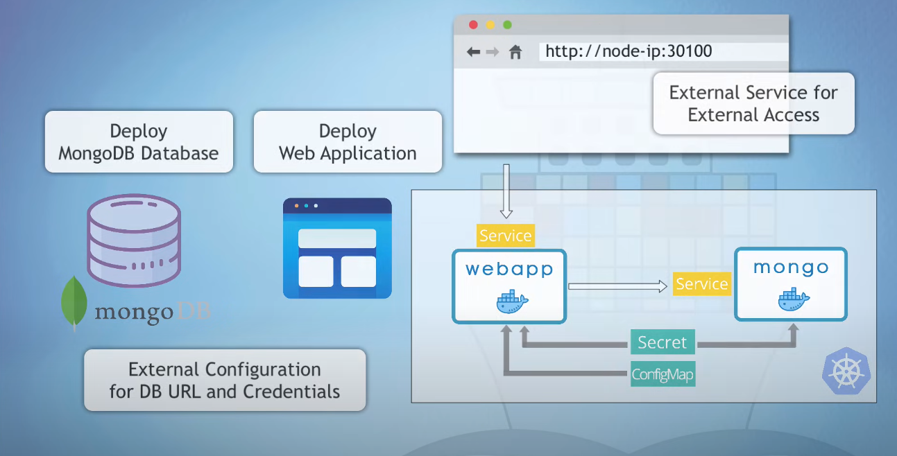

🚀 Kubernetes Demo Project: WebApp + MongoDB
📌 Overview

This project demonstrates how to deploy a MongoDB database and a Web Application on a Kubernetes cluster using:

ConfigMap → External configuration (DB URL).

Secret → Secure storage for credentials.

Deployment → Defines Pods for MongoDB & WebApp.

Service → Provides connectivity between components and external access to the WebApp.

The Web Application (anabhishekreddy/abhi:v1.0) connects to MongoDB using credentials from Secrets and DB URL from ConfigMap.

🏗️ Architecture




MongoDB Deployment & Service

Runs MongoDB as a single replica.

Credentials injected from mongo-secret.

Exposed via an internal Kubernetes Service (mongo-service).

WebApp Deployment & Service

Runs a custom Docker image (anabhishekreddy/abhi:v1.0).

Reads DB credentials from mongo-secret.

Reads DB URL from mongo-config.

Exposed outside the cluster using NodePort Service on port 30100.

Access

WebApp available at → http://<node-ip>:30100

📂 Repository Structure
.
├── mongo-config.yaml     # ConfigMap with DB URL
├── mongo-secrets.yaml    # Secret with MongoDB username & password
├── mongo.yaml            # MongoDB Deployment + Service
├── webapp.yaml           # WebApp Deployment + Service
└── README.md             # Project Documentation

```yaml
Step 1: Apply Kubernetes Configs
kubectl apply -f mongo-config.yaml
kubectl apply -f mongo-secrets.yaml
kubectl apply -f mongo.yaml
kubectl apply -f webapp.yaml

Step 2: Verify Deployments & Services
kubectl get pods
kubectl get deployments
kubectl get svc
